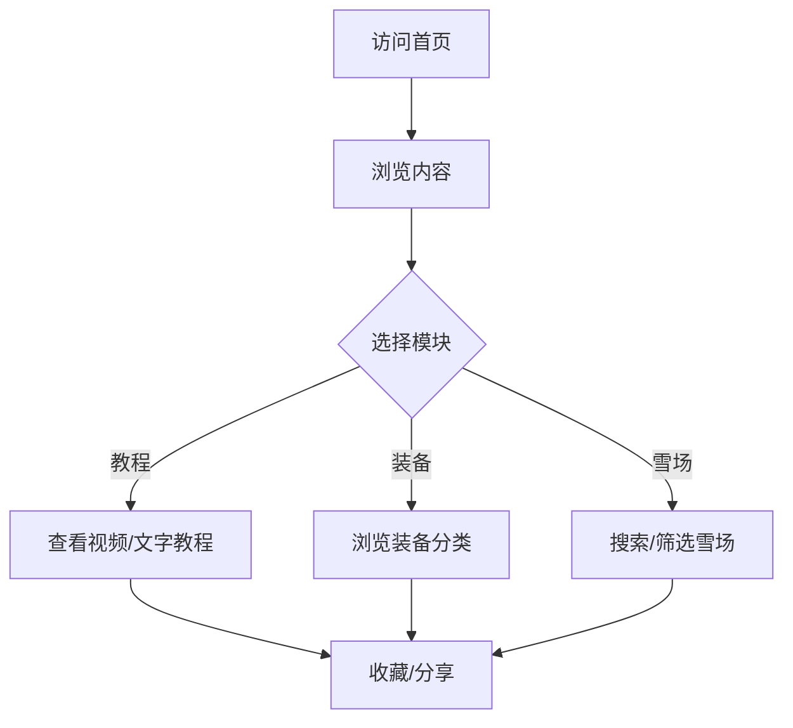

## 1. Product Overview
滑雪爱好者一站式信息平台，提供专业的滑雪教程、装备选择指导和雪场推荐服务，帮助用户快速掌握滑雪技能并规划滑雪之旅。
- 为滑雪初学者和爱好者提供全面的学习资源
- 帮助用户了解滑雪装备知识，做出明智的购买决策
- 推荐优质雪场，提升滑雪体验

## 2. Core Features

### 2.1 User Roles (if applicable)
| Role | Registration Method | Core Permissions |
|------|---------------------|------------------|
| Guest User | None | Browse all public content |
| Registered User | Email/Phone registration | Save favorites, track learning progress |

### 2.2 Feature Module
1. **Home page**: Hero banner, featured tutorials, popular resorts, quick navigation
2. **Tutorials page**: Beginner/intermediate/advanced tutorials, video guides, step-by-step instructions
3. **Equipment Guide page**: Gear categories, buying guides, brand comparisons
4. **Resorts page**: Resort listings, filtering, detailed resort profiles
5. **Favorites page**: Saved tutorials, resorts, equipment (for registered users)

### 2.3 Page Details
| Page Name | Module Name | Feature description |
|-----------|-------------|---------------------|
| Home page | Hero section | Dynamic carousel showcasing featured content |
| Home page | Quick links | Direct access to main sections |
| Home page | Featured tutorials | Highlight popular learning resources |
| Home page | Popular resorts | Display top-rated ski resorts |
| Tutorials page | Category filter | Filter by skill level (beginner/intermediate/advanced) |
| Tutorials page | Video gallery | Embedded video tutorials with descriptions |
| Tutorials page | Step-by-step guides | Detailed text instructions with images |
| Equipment Guide page | Gear categories | Organized by type (skis, boots, apparel, accessories) |
| Equipment Guide page | Comparison charts | Side-by-side product comparisons |
| Equipment Guide page | Buying tips | Expert advice for different skill levels |
| Resorts page | Location filter | Search by region/country |
| Resorts page | Resort cards | Display key info with ratings |
| Resorts page | Detailed profiles | Full resort information including trails, lifts, amenities |

## 3. Core Process
用户访问首页 → 浏览内容 → 选择感兴趣的模块（教程/装备/雪场）→ 查看详细信息 → 收藏或分享

## 4. User Interface Design

### 4.1 Design Style
- **Primary color**: Deep blue (#1e3a5f) - representing snow and winter
- **Secondary colors**: White (#ffffff), Light blue (#4a90d9), Orange accent (#ff6b35)
- **Button style**: Rounded corners (8px), gradient backgrounds for CTAs
- **Font**: Montserrat (display), Open Sans (body)
- **Layout style**: Modern card-based design with clean whitespace
- **Icon style**: Clean, minimal line icons

### 4.2 Page Design Overview
| Page Name | Module Name | UI Elements |
|-----------|-------------|-------------|
| Home page | Hero section | Full-width carousel with parallax effect, overlay text, CTA buttons |
| Home page | Quick links | 4 circular icons with hover effects |
| Home page | Featured tutorials | Card grid with thumbnail, title, duration, difficulty tag |
| Home page | Popular resorts | Horizontal scrollable cards with ratings and location |
| Tutorials page | Category tabs | Tab navigation with active state highlighting |
| Tutorials page | Video cards | Thumbnail with play button overlay, duration badge |
| Equipment Guide page | Category navigation | Vertical sidebar or horizontal tabs |
| Equipment Guide page | Comparison table | Responsive table with product specs |
| Resorts page | Filter sidebar | Collapsible filters for location, price, difficulty |
| Resorts page | Resort cards | Image, name, location, rating, price range |

### 4.3 Responsiveness
- **Desktop-first approach**
- **Mobile adaptive**: Collapsible navigation, stacked cards, touch-friendly buttons
- **Tablet support**: Adjusted grid layouts, responsive images

### 4.4 3D Scene Guidance (if applicable)
- Not applicable for this project