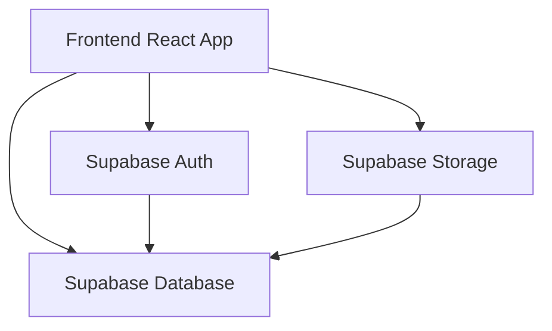
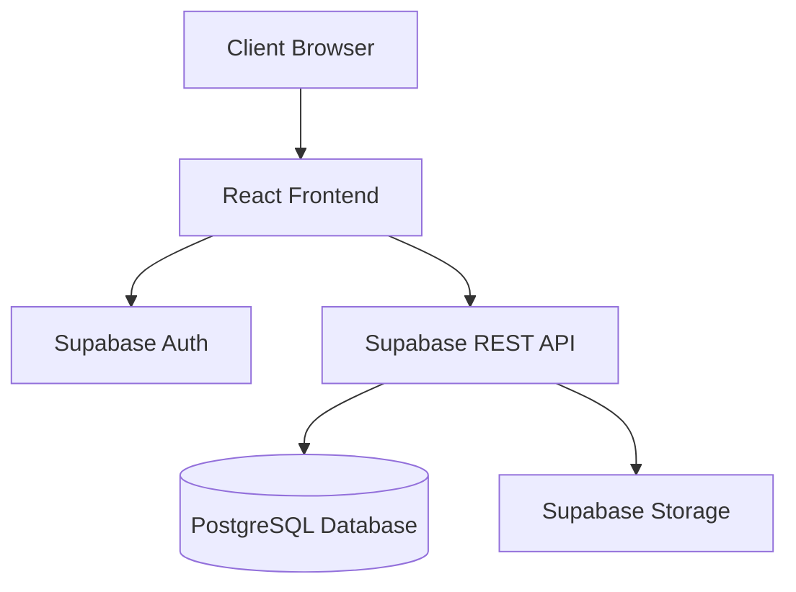
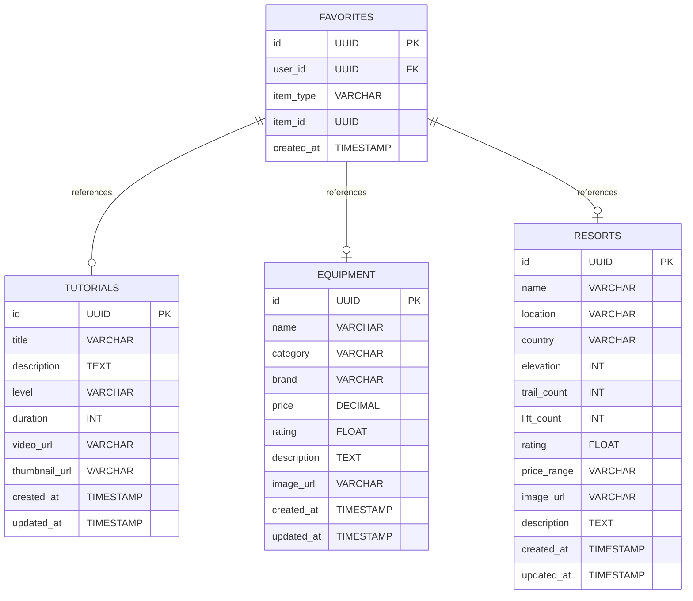

## 1. Architecture Design


## 2. Technology Description
- **Frontend**: React@18 + TypeScript + TailwindCSS@3 + Vite
- **Initialization Tool**: vite-init with react-ts template
- **Backend**: Supabase (Auth, Database, Storage)
- **Database**: Supabase PostgreSQL
- **Routing**: react-router-dom@6
- **State Management**: Zustand
- **Icons**: lucide-react

## 3. Route Definitions
| Route | Purpose |
|-------|---------|
| / | Home page with hero banner and featured content |
| /tutorials | Ski tutorials categorized by skill level |
| /equipment | Equipment guide with buying recommendations |
| /resorts | Ski resort listings with filters |
| /favorites | User's saved content (requires auth) |
| /tutorials/:id | Individual tutorial detail page |
| /resorts/:id | Individual resort detail page |

## 4. API Definitions
### 4.1 Tutorial Endpoints
- GET /api/tutorials - Get all tutorials
- GET /api/tutorials?level={level} - Filter by skill level
- GET /api/tutorials/{id} - Get single tutorial
- POST /api/favorites/tutorials/{id} - Save tutorial (auth required)
- DELETE /api/favorites/tutorials/{id} - Remove from favorites (auth required)

### 4.2 Equipment Endpoints
- GET /api/equipment - Get all equipment items
- GET /api/equipment?category={category} - Filter by category
- GET /api/equipment/{id} - Get single equipment item

### 4.3 Resort Endpoints
- GET /api/resorts - Get all resorts
- GET /api/resorts?location={location} - Filter by location
- GET /api/resorts/{id} - Get single resort detail
- POST /api/favorites/resorts/{id} - Save resort (auth required)
- DELETE /api/favorites/resorts/{id} - Remove from favorites (auth required)

## 5. Server Architecture Diagram


## 6. Data Model

### 6.1 Data Model Definition


### 6.2 Data Definition Language
```sql
-- Tutorials Table
CREATE TABLE tutorials (
    id UUID PRIMARY KEY DEFAULT gen_random_uuid(),
    title VARCHAR(255) NOT NULL,
    description TEXT,
    level VARCHAR(50) NOT NULL CHECK (level IN ('beginner', 'intermediate', 'advanced')),
    duration INT,
    video_url VARCHAR(255),
    thumbnail_url VARCHAR(255),
    created_at TIMESTAMP DEFAULT CURRENT_TIMESTAMP,
    updated_at TIMESTAMP DEFAULT CURRENT_TIMESTAMP
);

-- Equipment Table
CREATE TABLE equipment (
    id UUID PRIMARY KEY DEFAULT gen_random_uuid(),
    name VARCHAR(255) NOT NULL,
    category VARCHAR(50) NOT NULL,
    brand VARCHAR(100),
    price DECIMAL(10, 2),
    rating FLOAT CHECK (rating >= 0 AND rating <= 5),
    description TEXT,
    image_url VARCHAR(255),
    created_at TIMESTAMP DEFAULT CURRENT_TIMESTAMP,
    updated_at TIMESTAMP DEFAULT CURRENT_TIMESTAMP
);

-- Resorts Table
CREATE TABLE resorts (
    id UUID PRIMARY KEY DEFAULT gen_random_uuid(),
    name VARCHAR(255) NOT NULL,
    location VARCHAR(255),
    country VARCHAR(100),
    elevation INT,
    trail_count INT,
    lift_count INT,
    rating FLOAT CHECK (rating >= 0 AND rating <= 5),
    price_range VARCHAR(50),
    image_url VARCHAR(255),
    description TEXT,
    created_at TIMESTAMP DEFAULT CURRENT_TIMESTAMP,
    updated_at TIMESTAMP DEFAULT CURRENT_TIMESTAMP
);

-- Favorites Table
CREATE TABLE favorites (
    id UUID PRIMARY KEY DEFAULT gen_random_uuid(),
    user_id UUID REFERENCES auth.users(id),
    item_type VARCHAR(50) NOT NULL CHECK (item_type IN ('tutorial', 'equipment', 'resort')),
    item_id UUID NOT NULL,
    created_at TIMESTAMP DEFAULT CURRENT_TIMESTAMP
);

-- Indexes
CREATE INDEX idx_tutorials_level ON tutorials(level);
CREATE INDEX idx_equipment_category ON equipment(category);
CREATE INDEX idx_resorts_country ON resorts(country);
CREATE INDEX idx_favorites_user ON favorites(user_id);

-- Initial Data
INSERT INTO tutorials (title, description, level, duration, video_url, thumbnail_url) VALUES
('滑雪入门基础', '学习滑雪的基本姿势和安全知识', 'beginner', 15, 'https://example.com/video1', 'https://example.com/thumb1.jpg'),
('平行式转弯技巧', '掌握平行式转弯的核心技术', 'intermediate', 20, 'https://example.com/video2', 'https://example.com/thumb2.jpg'),
('高级自由式滑雪', '学习跳台和道具技巧', 'advanced', 25, 'https://example.com/video3', 'https://example.com/thumb3.jpg');

INSERT INTO equipment (name, category, brand, price, rating, description, image_url) VALUES
('全能滑雪板', 'skis', 'Atomic', 2999.00, 4.5, '适合各种雪况的全能板', 'https://example.com/ski1.jpg'),
('滑雪靴', 'boots', 'Salomon', 1599.00, 4.3, '舒适贴合的滑雪靴', 'https://example.com/boot1.jpg'),
('滑雪服', 'apparel', 'Columbia', 899.00, 4.0, '防水透气滑雪服', 'https://example.com/jacket1.jpg');

INSERT INTO resorts (name, location, country, elevation, trail_count, lift_count, rating, price_range, image_url, description) VALUES
('长白山万达滑雪场', '吉林白山', '中国', 2180, 37, 7, 4.6, '中高', 'https://example.com/resort1.jpg', '亚洲最大的滑雪场之一'),
('崇礼云顶滑雪场', '河北张家口', '中国', 2100, 41, 6, 4.5, '中高', '2022冬奥场地'),
('瑞士采尔马特', '采尔马特', '瑞士', 2400, 360, 34, 4.9, '高', 'https://example.com/resort2.jpg', '阿尔卑斯山顶级雪场');
```